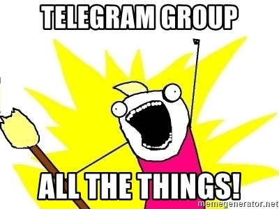

# TrashEmail 
[](https://travis-ci.org/r0hi7/Trashemail)

```diff
+ Bot is healthy UP and running :)
```

### tl;dr
TrashEmail is hosted Telegram bot that can save your private email address by offering disposable email address. It can create, manage, disposable email address and link them with your telegram bot chat. 
- **Where is the bot?** - [@trashemail_bot](https://t.me/trashemail_bot)
- **How can I create dispoable mail id?** - Decide a username & ask the bot :smile:
- **How many emails can I create?** - Right now, the count is **4**.
- **How can I access my emails?** - If there is an email for you, it will come to telegram :smile: Easy right.
- **Do I need to setup and remember any password?** - No Sir, that's the trick.
- **Why am I maintaining and hosting this?** - This is my first such tool for community :smile: I wanted to give something back to community. If you like the idea and wanted to contribute then [BuyMeACoffee](https://www.buymeacoffee.com/r0hi7)

#### How can I use this hosted service:
- Its super easy, just see the demo below.

[](https://www.youtube.com/watch?v=DB1orBm9VCY)

### What is Disposable Temporary E-mail? And How am I different?
Forget about spam, advertising mailings, hacking and attacking robots. Keep your real mailbox clean and secure.Trashemail provides temporary(or permanent), secure, anonymous, free, disposable email address. Want to get one ? its here : [@trashemail_bot](https://t.me/trashemail_bot)

**Disposable email** - is a service that allows to receive email at a temporary(Here in case, the temporary factor is upto you) address that self-destructed after a certain time elapses. It is also known by names like : tempmail, 10minutemail, throwaway email, fake-mail or trash-mail. Many forums, Wi-Fi owners, websites and blogs ask visitors to register before they can view content, post comments or download something. 

**Trashemail** is not most advanced throwaway email service but a reliable service that helps you avoid spam, stay safe and get emails delivered directly to your [@trashemail_bot](https://t.me/trashemail_bot) *Telegram bot*. And in case you are getting too many such mails, just delete the email Id :) with one click(oops command, since this is telegram bot).

There are websites that offers such sort of functionalities (like https://temp-mail.org/en/ etc) but the certain issues with such platforms:
1. Your information is safe or not you can't audit.
2. The domain keeps changing as soon as they are identified as temp-mail domains.
3. Everytime you have to visit site to get one, you can't keep the same temporary mail for long.
4. And, their business model which makes you see lot of ads in website.

Considering all of this, I decided to make a open source project out of my hobby and thought of offering it as a service to others :)
How my service is ~better~ than theirs:
1. The entire source code is open for audit, I am not interested in your data at all.
2. Right now I own a domain trashemail.in and you will get emailIds from this domain only. (Easy for you to remember).
3. The temporary time for your emailId to be alive is on you, not on the server, you can keep it permanently as well, or as long as I am able to maintain the [@trashemail_bot](https://t.me/trashemail_bot).
4. This project is out of passion, so I don't have motive of earning anything, so **No Ads**.(I am serious, I hate them too, like you)
5. I am always open to suggestion, feedback & Issues to work on.
 

### Let's talk about the [Source](https://github.com/r0hi7/Trashemail).
TrashEmail is Java spring-boot microservice that anyone can build locally currently with few setting to tune in and then have the entire setup running locally.
 All you need to own is mail server(SMTP and IMAP), telegram bot token and `mvn` locally to build it.
 Few requirements with the mailserver:
 1. SMTP host should allow **Alias** creation.
 2. IMAP server should support **IDLE**.

I have to update the config slightly, and will do it quickly. :)

All you need to do is clone the source, build and run, and just tell telegram that you are listening here.
```shell script
git clone https://github.com/r0hi7/Trashemail.git
cd Trashemail

# Update the application.yml file
# according to your mail server

mvn clean install
# If successfull
java -jar target/trashemail target/teledot-0.0.1-SNAPSHOT.jar
```
Dev config may look like this:
```yaml
# Email Server IMAP and SMTP configuration
# SMTP server should support Alias creation and deletion
# IMAP server should support IDLE

email-server:
  hosts:
    - trashemail.in
    - thromail.com
    - humblemail.com
  admin-email: contact@trashemail.in
  admin-password: changeme
  add-url: https://trashemail.in/admin/mail/aliases/add
  remove-url: https://trashemail.in/admin/mail/aliases/remove
  imap:
    host: trashemail.in
    port: 993
    email: contact@trashemail.in
    password: changeme

# Telegram bot specific settings
telegram:
  url: https://api.telegram.org/bot
  botToken: xxxxxxxxxxxxxxxxxxxxxx
  size: 4096

# For development purpose, H2 is used.
# I prefer H2 persistent in file.
spring:
  datasource:
    url: jdbc:h2:file:./AppDB;DB_CLOSE_ON_EXIT=FALSE;AUTO_RECONNECT=TRUE
    driver-class-name: org.h2.Driver
    username: sa
    password: password
  jpa:
    database-platform: org.hibernate.dialect.H2Dialect
    hibernate:
      ddl-auto: update
  h2:
    console:
      path: /h2-console
      settings:
        web-allow-others: true
      enabled: true
  application:
    name: Trashemail

# Tomcat server settings
server:
  port: 9090

# Trashemail app server settings
trashemail:
  max-emails-per-user: 4

# Logger settings
logging:
  level:
    io:
      github:
        trashemail: debug
```

1. This code will spin up the service at `localhost:9090/telegram/new-message` endpoint.
2. Now will have to expose this service to internet, and there are options like : `ngrok`, `dataplicity`, `localtunnel` etc.
3. DB is taken care by `h2`, in a file, (I think that is sufficient, It need very light DB table).
4. Get a bot for you from, [Telegram Bot Father](https://telegram.me/BotFather)
5. The last step is important, tell telegram that where you are listening :)
    ```shell script
    curl -F "url=https://<YOUR_DOMAIN>/telegram/new-message" https://api.telegram.org/bot<BOT_TOKEN>/setWebhook
    ```
6. And you are done.

### How It Works
1. For this bot to work, you need existing SMTP, IMAP setup.
    1. SMTP with Alias creation
    2. IMAP with IDLE enabled
3. As user, requests for creation,
2. It fools the user, that it created an email Id rather it creates an alias to exiting ID.
    1. Why Alais, as IMAP needs to poll right, for incoming mails? This is how it is engineered.
3. Runs a background async service to poll IMAP server.
4. As soon as mail is fetched, the target is identified and telegram message is sent.

I have tried to engineer this service to be reliable, in case if you find any issues with the reliability(or with anything else), please feel free to drop in a PR. I would be happy to review and merge.

### Sponsors
1. Two domains [thromail.com](thromail.com) & [humblemail.com](humblemail.com) are proudly donated by [zlipa.com](https://zlipa.com/)
2. If you like the idea, then buy me a coffee, I will get caffine in my blood and to spend extra nights to make this product secure, up and running :smile:

<a href="https://www.buymeacoffee.com/r0hi7" target="_blank"></a>

3. Or you can drop in a :star:, this motivates me.

### Credits


Can't find one for the BOT. L0L

